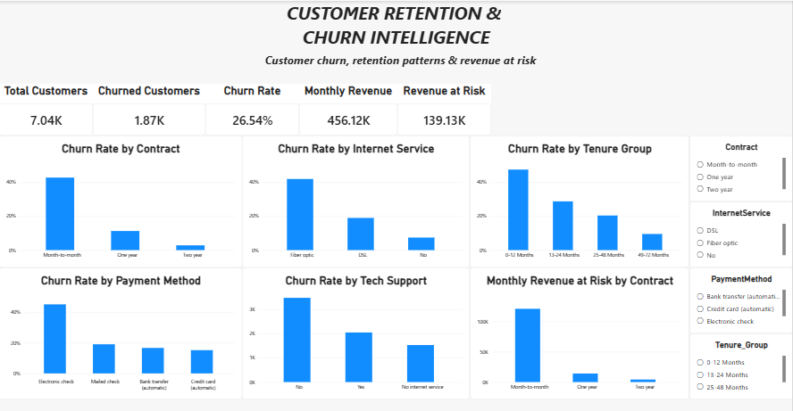

# Customer Churn Analytics — End-to-End Data Analyst Project

## 📌 Project Overview

An end-to-end customer churn and retention analytics project built to identify customer groups with higher churn rates and quantify monthly revenue at risk.

The project covers data cleaning, SQL analysis, customer segmentation, KPI development, and interactive Power BI dashboards.

## 🎯 Business Problem

The business wants to understand:

- Overall customer churn
- Customer segments with higher churn
- How contract type affects churn
- How customer tenure relates to churn
- Churn patterns by payment method and internet service
- Monthly revenue at risk from churned customers
- Customer groups that may require retention attention

## 📊 Key KPIs

| KPI | Result |
|---|---:|
| Total Customers | 7,043 |
| Churned Customers | 1,869 |
| Overall Churn Rate | 26.54% |
| Total Monthly Revenue | $456.12K |
| Monthly Revenue at Risk | $139.13K |

## 🔎 Key Business Insights

### Contract Type
- Month-to-month customers had a 42.71% churn rate.
- One-year customers had an 11.27% churn rate.
- Two-year customers had a 2.83% churn rate.

### Customer Tenure
- Customers with 0–12 months of tenure had a 47.44% churn rate.
- Customers with 49–72 months of tenure had a 9.51% churn rate.

### Payment Method
- Electronic check customers had a 45.29% churn rate.
- Mailed check customers had a 19.11% churn rate.
- Bank transfer customers had a 16.71% churn rate.
- Credit card customers had a 15.24% churn rate.

### Internet Service
- Fiber optic customers had a 41.89% churn rate.
- DSL customers had an 18.96% churn rate.
- Customers with no internet service had a 7.41% churn rate.

### Revenue at Risk
- Churned customers represented approximately $139.13K in monthly charges.
- Month-to-month contracts contributed approximately $120.85K of monthly revenue at risk.

## 🛠️ Tools & Technologies

- Microsoft Excel
- MySQL
- SQL
- Power BI
- DAX
- Data Cleaning
- Data Visualization
- Customer Segmentation
- Business Analytics

## 🧹 Data Preparation

The dataset was reviewed and prepared before analysis.

Steps included:

- Duplicate checks
- Blank/missing-value checks
- Data type validation
- Numeric field validation
- Customer-level data validation
- Creation of tenure groups
- Creation of monthly charge bands
- Creation of churn and revenue-at-risk calculations

## 🧮 SQL Analysis

SQL analysis included:

- Aggregate functions
- Conditional aggregation
- CASE statements
- GROUP BY
- Churn-rate calculations
- Revenue-at-risk calculations
- Customer segmentation
- RANK()
- ROW_NUMBER()
- DENSE_RANK()
- SQL views

## 📈 Power BI Dashboard

### Executive Overview

The dashboard includes:

- Total Customers
- Churned Customers
- Churn Rate
- Monthly Revenue
- Revenue at Risk
- Churn Rate by Contract
- Churn Rate by Internet Service
- Churn Rate by Tenure Group
- Churn Rate by Payment Method
- Churn Rate by Tech Support
- Monthly Revenue at Risk by Contract
- Interactive slicers

### Customer Risk & Segmentation

The second dashboard page includes:

- Contract × Internet Service churn matrix
- Monthly Revenue at Risk by Internet Service
- Monthly Revenue at Risk by Tenure Group

## 📂 Project Files

- `Churn_Analysis_PBI.pbix` — Power BI dashboard
- `Churn_Analytics_sql.sql` — SQL analysis
- `Telco_Customer_Churn_Cleaned.xlsx` — cleaned dataset
- `Churn_Dashboard_Screenshot1.png` — Executive Overview
- `Churn_DashboardScreenshot2.png` — Customer Risk & Segmentation

## 💡 Project Outcome

This project demonstrates an end-to-end analytics workflow:

**Data → Cleaning → SQL → Business Analysis → DAX → Power BI → Business Insights**

The analysis helps identify customer groups with higher churn and quantify the associated monthly revenue exposure.

## 📈 Power BI Dashboard

### Executive Overview

### Customer Risk & Segmentation

https://github.com/Simran-Pasha/Customer-Churn-Analytics-E2E/blob/main/Churn_Dashboard_Screenshot2.png
